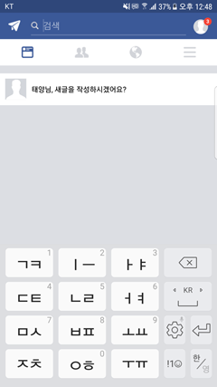
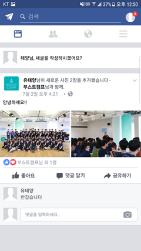

# 안드로이드 미니프로젝트 1

  
  
   
  <b>[실행 화면]</b>

  
## 1. 개요
페이스북 페이지를 유사하게 만들어보는 미니프로젝트 입니다.  

## 2. 설명
* 새 글 작성 탭을 클릭하면 숨어있던 글쓰기 창이 나타나게 됩니다.  
* 텍스트를 입력하고 게시 버튼을 누르면 하단에 게시물이 추가됩니다.  
* 여러 게시물을 작성한 경우 스크롤을 통해 하단의 게시물들을 확인할 수 있습니다.  
* 작성된 게시물에 댓글을 작성할 수 있습니다.  
* 이외의 메뉴를 선택하는 경우 미구현 기능이라는 토스트가 나타나게 됩니다.  

## 3. 실행

  
   
  <b>[글쓰기 기능]</b>
     
   
  <b>[댓글쓰기 기능]</b>

